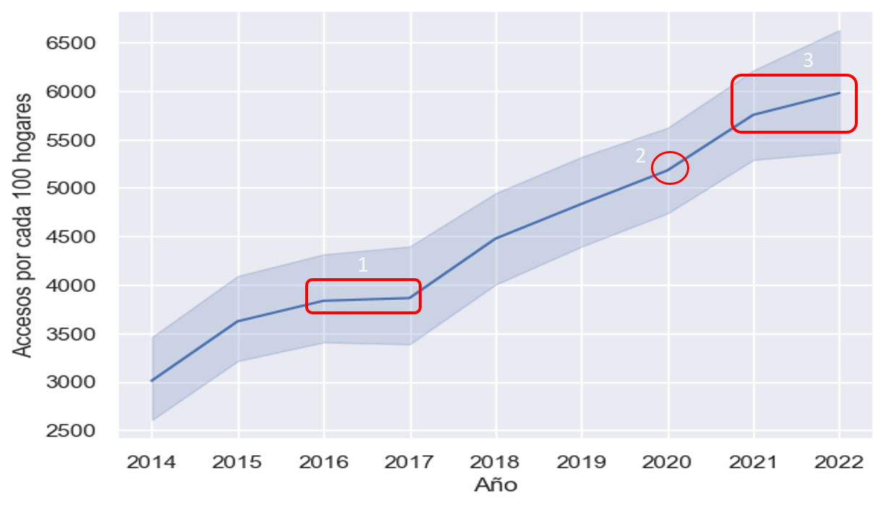
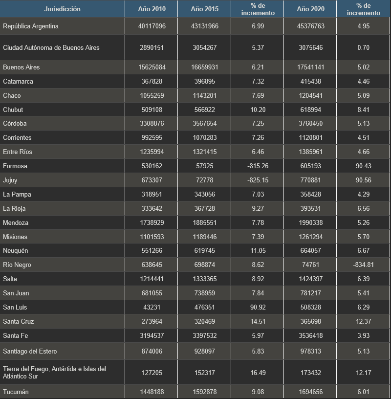
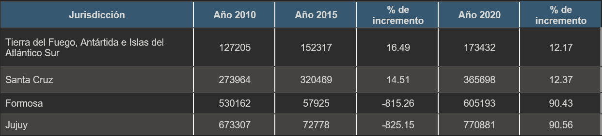

<h1 align='center'>
 <b>PROYECTO INDIVIDUAL Nº2 (DATA ANALYTICS) - Alfonso Justo</b>
</h1>

# <h1 align="center">**`Telecomunicaciones`**</h1>

¡Bienvenidos al último proyecto individual de la etapa de labs! En esta ocasión, deberán hacer un trabajo situándose en el rol de un ***Data Analyst***.

## **Descripción del problema -contexto y rol a desarrollar-**

### **Contexto**

Las telecomunicaciones se refieren a la transmisión de información a través de medios electrónicos, como la telefonía, la televisión, la radio y, más recientemente, el internet. Estos medios de comunicación permiten la transmisión de información entre personas, organizaciones y dispositivos a largas distancias.

El internet, por su parte, es una red global de computadoras interconectadas que permite el intercambio de información en tiempo real. Desde su creación, ha tenido un impacto significativo en la vida de las personas, transformando la manera en que nos comunicamos, trabajamos, aprendemos y nos entretenemos.

La industria de las telecomunicaciones ha jugado un papel vital en nuestra sociedad, facilitando la información a escala internacional y permitiendo la comunicación continua incluso en medio de una pandemia mundial. La transferencia de datos y comunicación se realiza en su mayoría a través de internet, líneas telefónicas fijas, telefonía móvil, y en casi cualquier lugar del mundo. 

En comparación con la media mundial, Argentina está a la vanguardia en el desarrollo de las telecomunicaciones, teniendo para el 2020 un total de [62,12 millones de conexiones](https://www.datosmundial.com/america/argentina/telecomunicacion.php).
   

## **PRESENTACIÓN**
Al ser el analista encargado de realizar este trabajo, se entregaron las siguientes tareas a realizar:

- ETL / EDA
- ANÁLISIS
- KPI´s
- DASHBOARDS

Se ordenó de forma diferente a como lo mostraban en la consigna, pero fue necesario hacerlo así, ya verán por qué.

Iniciamos con el ETL/EDA, se decidió realizar un ETL porque en los datos con los que se trabajarían estaban alojados en una página de internet, entonces se tenia que extraer de ahí la información. Se tenían dos opciones, hacerlo mediante una API que la página web nos facilitaba y hacerlo de forma manual. 

En esta ocasión se intentó realizar mediante la extracción por parte de la API, pero se presentaron algunos problemas de conexión por parte de la página, lo que provocó que no se pudieran descargar algunos archivos, así que se hizo de forma manual también para la mayoría de los datasets, los cuales eran aproximadamente 15, adicional que se tenían algunos opcionales que también se descargaron, sumando con eso aproximadamente 33 datasets.

No se explicará exactamente que se hizo con cada uno de los datasets, pero se realizaron con Python, estas acciones las pueden ver en los archivos llamados ‘eda_obligatorios.ipynb’, ‘eda_opcionales.ipynb’ Y ‘eda_adicional.ipynb’.

En esos procesos se tocaron 3 puntos solicitados, ahí se hizo el ETL, el EDA y el Análisis.

La parte del ETL fue un poco confusa, ya que en los datasets que son obligatorios tomar en cuenta, se tenían algunos errores.

Como vemos, al no conocer a que se refieren algunas columnas, fue complicado tomar todas las columnas y archivos. 

Así que como parte del análisis se realizó una investigación con respecto a los datos que hacían falta, a que se refería todo eso y bueno, me di cuenta que había otro archivo con características similares, aunque realmente, el compararlos, decidí no utilizar este archivo específico, porque a diferencia del otro archivo, ese que se ve no dice cantidades solo SI, y aunque podía poner 1 a los SI y 0 a las celdas que tienen "--" representando NO, no aportaría la información que el otro, y para no gastar tiempo, se descartó.

Conforme se avanzaba con los procesos mencionados, se determinó que únicamente se usarían 8 datasets (aunque más adelante se realizaron algunas modificaciones, como unificar los datasets que presentan información Trimestral específicamente y los que presentaban información de Provincias, se decidió subir así los datasets separados para que se pudiera entender mejor como se hicieron los procesos). 
  

## **DESARROLLO**
Bien, pasando a los hallazgos que el EDA me mostró y en conjunto con la revisióin de todos los datos, veremos los más interesantes. 
En el análisis vamos a concentrarnos en 4 aspectos, que funcionarán como KPI: 
-	Penetración del Mercado (Conexiones de internet por cada 100 hogares)
-	Ingresos (Ingresos Anuales)
-	Velocidad de Internet (Velocidad Promedio de Internet por Provincia)
-	Tecnología (Conexiones mediante Fibra Óptica)

Esto se decidió después de validar todos los datos disponibles, se piensa que el futuro de la empresa se basa en estos tres puntos, que son los pilares de un crecimiento adecuado, si bien conocemos que se tiene más información con los datasets adicionales, pero para realmente hacer que la empresa pueda tener un sustento adecuado, incremento de valor y ser la mejor, debemos comenzar ofreciendo velocidad de internet rápido, teniendo más presencia en el mercado, eso se convertirá a más ingresos.

Iniciamos viendo la **Penetración de Mercado** que se tiene por parte de la empresa, viendo los Accesos por cada 100 hogares de forma anual en el total de las provincias.

 
Esta gráfica resulta interesante porque vemos el camino del crecimiento que se ha tenido por parte de la empresa en el mercado desde 2014 y 2022.

Vamos a resaltar los puntos importantes para tener en cuenta, pero antes, veamos otra gráfica de como se vio el crecimiento. 

 
Esta gráfica es un poco más amigable, y se nota con mayor facilidad los incrementos, los caminos “estancados” y el repunte de estos. 
Pero volviendo a la primera, veamos los puntos interesantes. 

 
El punto 1 es interesante porque aunque no decayeron las ventas, se mantuvieron sin incrementar, entonces se debe revisar que fue lo que pasó en ese caso para poder ver que campañas o promociones se han tenido, porque el incremento fue mínimo, adicional, que dentro del mismo punto, en 2017 se ve un incremento considerable muy de golpe y enormemente, esta parte es interesante porque se cambió algo, eso nos deberá ayudar para futuras campañas junto con las tendencias actuales del mercado y sociales.

El punto 2 es interesante porque ahí se ve un incremento nuevamente, debemos estudiar lo que se realizó en ese periodo para del mismo modo poderlo aplicar en un futuro.

Y el punto 3 es preocupante porque hay una disminución, y aunque en ingresos, no se ve reflejado porque incrementó, pero después de llevar un ritmo adecuado de crecimiento, ahí se vio disminuido.

Con esto, pasamos directamente a la parte de los **ingresos**. 

 
Esta gráfica primeramente se ve el incremento de ingresos en el servicio de internet por año, y a simple vista podemos notar como el crecimiento ha progresado correctamente, y donde empezamos a ver un incremento significativo es de 2019 hasta 2022, siendo de 2021 a 2022 el incremento más alto.

Pero ¿esto porque fue o que lo provocó? Simple, recordemos que pasamos por una pandemia mundial, lo que nos llevó a estar en casa un tiempo, por esta razón, más y más personas tuvieron que realizar la contratación de servicios de internet para poder trabajar principalmente desde casa o poder distraerse con el contenido que diferentes plataformas nos proporcionan.

Esto lo podemos encontrar en diferentes fuentes de información, como, por ejemplo, en la página del Gobierno Argentino [Gobierno Argentino](https://www.argentina.gob.ar/noticias/estado-de-situacion-de-la-cobertura-de-casos-por-covid-19#:~:text=Esta%20medida%20fue%20sucesivamente%20prorrogada,31%20de%20enero%20de%202021.) (2022), la cual dice que:

    “Mediante el Decreto 297/2020 se estableció la medida de “Aislamiento Social, Preventivo y Obligatorio” (ASPO) desde el 20 hasta el 31 de marzo de 2020 y, finalmente, hasta el 31 de enero de 2021 […] Esta medida fue sucesivamente prorrogada hasta el 31 de diciembre de 2022 […]mediante Decreto 260/2020” (Argentina, 2022)

Si bien, el aislamiento comenzó a partir de marzo de 2020, el rumor de que en otros países se estaba llevando a cabo esta práctica, se concluye que esto pudo llegar a oídos del mundo, lo que provocó se tomaran precauciones al respecto, esto provocaría que se pudieran cerciorarse de que se tuviera una buena conexión a internet por si se terminada acatando las mismas instrucciones, y bueno, así fue.

El incremento más notorio es de 2021 a 2022, y esto fue por el crecimiento que se tuvo de los usuarios que dejaron sus trabajos para dedicarse a tiempo completo a la “creación de contenido”, como lo dice [Forbes Argentina](https://www.forbes.com.ec/innovacion/como-alzheimer-leqembi-farmaco-fda-aprobo-tratar-alzheimer-n36688.) (2022), *“En la Argentina se incrementó […] pasando del 13% en 2019 al 15% este año (2022)”*.

Esto lo confirmamos con otra de las gráficas.

 
Es significativa esta gráfica porque vemos lo que antes se menciona, a partir del último trimestre del 2019, con la expansión de la pandemia en ese periodo, vemos como el incremento es sustancialmente más grande de como normalmente se venia realizando, viendo un incremento progresivo a partir de ese último trimestre del año.

Visto en forma de tabla vemos lo siguiente.

 
Sin quitarle el peso que tiene una tabla bien ordenada, vemos como es que, de tener un incremento de ingresos interesantes, de 2021 a 2022 no se incrementaron mucho, esto es preocupante porque el ritmo que se llevaba no se siguió, entonces debemos revisar que está pasando, con ventas y atención al cliente.   

## Velocidades de la conexión a Internet y Tecnología
En esta gráfica podemos ver las velocidades de internet que se tuvieron por año, desde 2014 hasta 2022.

 
Como podemos ver, la lista la encabezaba una velocidad muy baja (1 – 6 Mbps), lo cual no era bueno para el negocio, pero derivado del incremento de conexiones y la demanda que se tenia sobre la empresa, el sorprendente incremento de la conexión con velocidad mayor a 30 Mbps es increíble, pasamos de 2019 a 2022 a incrementar súbitamente la velocidad, cosa que no se hacía de 2014 a 2018. 

Esto provocó que se tuvieran decrementos por obvias razones de las otras velocidades, ya que todos necesitaban y querían una velocidad prudente para las nuevas actividades que se debían realizar, nuestra nueva realidad.

Esto nos lleva a conocer como es que se dio ese incremento tan grande, y bien, es por esta razón que se verá en la siguiente gráfica.

 
Al inicio, los servicios alámbricos (la conexión ADSL) eran lo que tenían más presencia en los hogares, lo que después de algunos años, se cambió por la tecnología que nos brindan los Cablemodems, esto de verdad provocó un cambio impactante en la tecnología alámbrica, llevándolo en picada a partir de parte del año 2017, quitándole el trono de ser el servicio más usado.

Este cambio se mantiene hasta hoy en día, pero al ver la caída trepidante de los servicios alámbricos, vemos como otro competidor entra en el juego, y es el responsable de que las velocidades de internet sean mucho más rápidas, la Fibra Óptica, que en el transcurso del año 2021 vemos como ya incluso supera a los servicios ADSL. 

Esta tecnología traerá consigo velocidades más rápidas que podemos aprovechar.

Así que, con la información proporcionada podemos ver cuales son las ciudades que tienen mejores velocidades de internet, esto lo vemos con la gráfica que nos muestra los Mbps que se tienen por Provincia.

 
Esta información para el estudio vale oro, porque conociendo esto, podemos conocer cuál podría ser la siguiente inversión en infraestructura para el mejoramiento de las velocidades de conexión a internet, tratando de ser el mejor servicio del país.

Para complementar la información y poder tomar una mejor decisión de lo comentado, buscaremos las poblaciones que se tienen en las diferentes Provincias para ver cual sería el camino correcto.

Poblaciones de Argentina con el paso del tiempo.

     Fuente: Gobierno de Argentina.

 
Entonces, vemos cuales serían las ciudades con mayor incremento poblacional.

Fuente: Gobierno de Argentina.

 
Si lo comparamos con la gráfica, vemos que Santa Cruz y Tierra de Fuego son las ciudades que se tiene más posibilidad de poder realizar la inversión, por tener un incremento mayor del 10% de la población, además que en la gráfica presentada vemos que esas dos ciudades son las que tienen menor velocidad de internet.
   

## CONCLUSIONES
Para terminar, me gustaría resaltar que si bien se tiene más información con respecto a diferentes servicios como lo es telefonía fija, radio, etc. 

Se decidió concentrar los esfuerzos en la investigación pertinente para defender los puntos que se presentaron como importantes, y esto es porque derivada de la experiencia que se ha tenido con los trabajos anteriores, si se cuida al cliente, se da un poco más de lo esperado, se queda, se fidelizan, entonces, al trabajar en ver como es posible que los usuarios tengan una conexión a internet rápida, podemos tener la mejor publicidad, la que se hace sola y de boca en boca. 

Ahora, porque preocuparse por la penetración de mercado, porque viendo el [Listado de Proveedores de Internet en Argentina](https://datosabiertos.enacom.gob.ar/dashboards/20000/acceso-a-internet/) y como vemos, **SON BASTANTES**.

Entonces, la competencia es fuerte, pero teniendo la fidelidad y la recomendación de los usuarios por tener un servicio rápido y estable, podemos tener una mejor penetración de mercado, quizá menos, es más, y si no se tiene la opción aún de fibra óptica, el tener un servicio que no se caiga (o al menos tan seguido) y que no tenga tantas interrupciones, quizá no es el de más de 30 Mbps, pero si de 20 a 30, con esa estabilidad, será una buena carta de presentación interesante para ganar usuarios.

Y bueno, los ingresos son algo obvio que caerán por el peso de lo anteriormente dicho, así que, si se quiere tener ganancias, hay que invertir, ser rápidos y ganar mercado a la competencia.

El trabajo se realizó usando Python, PowerBI y Excel, comprobando y haciendo las debidas modificaciones.

No hay que desestimar la potencia de algunos elementos que se usaron, como una tabla tal cual y el Excel, son parte de las herramientas que podemos usar. 

No son millones de datos,  entonces Excel fue una herramienta útil para ver los datos juntos sin tanto esfuerzo, por eso es que fue utilizado.   

### **Referencias**

Forbes Argentina. (09 de mayo de 2022). Informe gráfico: Cómo evolucionó la influencia de los influencers. Forbes. https://www.forbes.com.ec/innovacion/como-alzheimer-leqembi-farmaco-fda-aprobo-tratar-alzheimer-n36688

Gobierno de Argentina. (14 de enero de 2022). Estado de situación de la cobertura de casos por covid-19. Argentina. https://www.argentina.gob.ar/noticias/estado-de-situacion-de-la-cobertura-de-casos-por-covid-19#:~:text=Esta%20medida%20fue%20sucesivamente%20prorrogada,31%20de%20enero%20de%202021.

Gobierno de Argentina. (2010). Población. Argentina. https://www.ign.gob.ar/NuestrasActividades/Geografia/DatosArgentina/Poblacion2

Gobierno de Argentina. (s.f.). Listado de proveedores de servicios de internet de todo el país [Archivo .pdf]. Argentina. https://www.argentina.gob.ar/sites/default/files/isp_por_provincias_2.pdf
